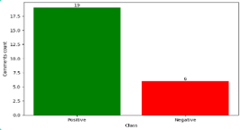
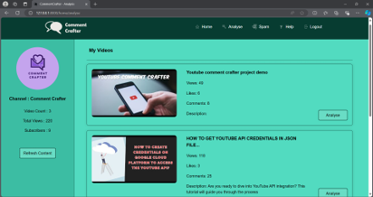

# 🚀 Automated Toxic and Spam Detection in YouTube Comments using BERT  

## 📌 Overview  
This project automates the classification of YouTube comments into toxic and spam categories using **BERT (Bidirectional Encoder Representations from Transformers)**. By leveraging **Natural Language Processing (NLP)** and **Machine Learning (ML)**, the model accurately detects harmful or irrelevant comments, helping in content moderation.

## 🚀 Getting Started  
Follow the steps below to download, set up, and run the project on your local machine.

### **1️⃣ Prerequisites**  
Ensure you have the following installed:  
- **Python 3.8+**  
- **pip (latest version)**  
- **Jupyter Notebook or Google Colab (for experimentation, optional)**  
- **CUDA-enabled GPU (recommended for faster inference)**  

### **2️⃣ Clone the Repository**  
Run the following command in your terminal:  
```bash
git clone https://github.com/your-username/repo-name.git
cd repo-name
```

### **3️⃣ Install Dependencies**  
Install the required Python libraries:  
```bash
pip install -r requirements.txt
```

### **4️⃣ Dataset Preparation**  
- The model requires a labeled dataset of YouTube comments with categories like **toxic, spam, offensive, neutral, etc.**  
- If using a public dataset, download and place it in the **`data/`** directory.  
- Example format (CSV):  
  ```
  comment,text_label
  "This is a spam message", "spam"
  "You are the worst!", "toxic"
  ```

### **5️⃣ Train the Model**  
To train the BERT model on YouTube comments, run:  
```bash
python train.py
```
- The script will **fine-tune BERT** on the dataset and save the model to the `models/` directory.

### **6️⃣ Evaluate the Model**  
To test the model’s accuracy, run:  
```bash
python evaluate.py
```
- The script will provide **F1-score, accuracy, and precision** for classification performance.

### **7️⃣ Run the Inference Script**  
To predict whether a comment is toxic or spam, use:  
```bash
python predict.py --text "Your comment here"
```
Example output:  
```bash
Comment: "Get free followers now!"
Prediction: Spam
```

### **8️⃣ Deploy as an API (Optional)**  
To serve the model using **Flask/FastAPI**, run:  
```bash
python app.py
```
Then open your browser and go to:  
```
http://127.0.0.1:5000/predict?text=Your+comment+here
```

## 🎯 Features  
✔️ **BERT-based text classification** for high accuracy  
✔️ **Detects toxic and spam comments** in real-time  
✔️ **Fine-tuned model** on YouTube comments dataset  
✔️ **Supports API integration** for automated moderation  
✔️ **Can be deployed on cloud platforms** (AWS, GCP, etc.)  

## 📸 Output Screenshots  
## 📸 Output Screenshots  

### 🔹 Training Graphs  
   

### 🔹 Model Performance  
   

### 🔹 Prediction Examples  
   

### 🔹 Web API Interface  
  

## 🤝 Contributing  
Want to contribute? Follow these steps:  
1. **Fork the repository**  
2. **Create a new branch**:  
   ```bash
   git checkout -b feature-branch
   ```
3. **Commit your changes**:  
   ```bash
   git commit -m "Added new feature"
   ```
4. **Push the branch**:  
   ```bash
   git push origin feature-branch
   ```
5. **Open a Pull Request on GitHub**  
